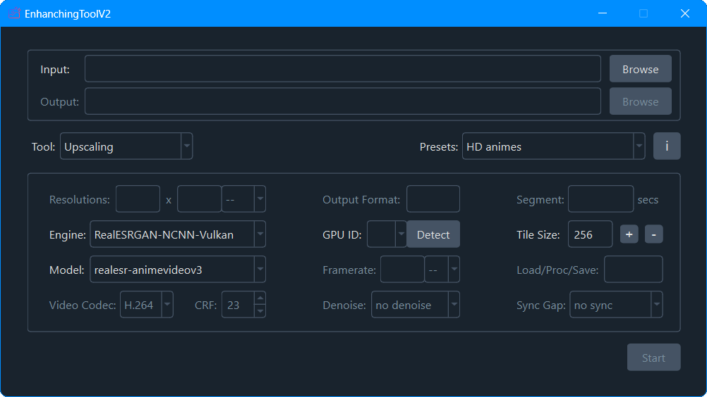
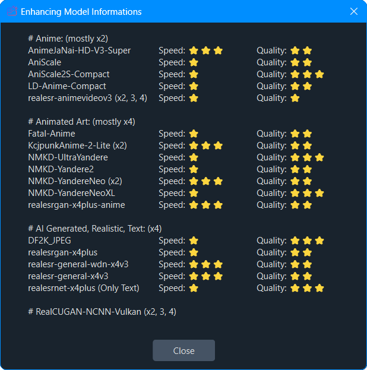

<h2 align="center"> EnhancingToolV2: Video Frame Interpolation and Super Resolution </h2>

# ℹ️About EnhancingToolV2
EnhancingToolV2 is a state-of-the-art GUI application that utilizes advanced AI and NCNN inference by Tencent which is lightweight and runs on NVIDIA, AMD for video frame interpolation and image/video upscaling. It's designed with the Qt framework to provide a seamless user experience, offering intuitive controls for professional-quality enhancements.

## ✨Key Features
- Full image style support (2D anime, or your daily photos & videos)
- Provides recommended presets for specific purposes
- Allows adjusting the tile size and the number of threads freely
- Adjusts the settings automatically to handle errors that occur during the upscaling or interpolating process
- Allows resizing to a specific resolution after upscaling
- Detects additional ESRGAN models automatically
- Easy-to-use graphical user interface
- Receives continual maintenance and updates

## 📦Built-in Models

### Upscaling
>**realesr-animevideov3** - powered by [Xintao](https://github.com/xinntao)

>**realesrgan-x4plus** - powered by [Xintao](https://github.com/xinntao)

>**realesrgan-x4plus-anime** - powered by [Xintao](https://github.com/xinntao)

>**realesr-general-x4v3** - powered by [Xintao](https://github.com/xinntao)

>**realesr-general-wdn-x4v3** - powered by [Xintao](https://github.com/xinntao)

>**realesrnet-x4plus** - powered by [Xintao](https://github.com/xinntao)

>**AnimeJaNai-HD-V3-SuperUltraCompact** - powered by [the-database](https://github.com/the-database)

>**AniScale** - powered by [Sirosky](https://github.com/Sirosky)

>**AniScale2S-Compact** - powered by [Sirosky](https://github.com/Sirosky)

>**DF2K_JPEG** - powered by [jixiaozhong](https://openmodeldb.info/users/jixiaozhong)

>**Fatal-Anime** - powered by [Twittman](https://openmodeldb.info/users/twittman)

>**KcjpunkAnime-2-Lite** - powered by [KCJPUNK](https://openmodeldb.info/users/kcjpunk)

>**LD-Anime-Compact** - powered by [Skr](https://openmodeldb.info/users/skr) and [Zarxrax](https://openmodeldb.info/users/zarxrax)

>**NMKD-UltraYandere** - powered by [Nmkd](https://openmodeldb.info/users/nmkd)

>**NMKD-Yandere2** - powered by [Nmkd](https://openmodeldb.info/users/nmkd)

>**NMKD-YandereNeo** - powered by [Nmkd](https://openmodeldb.info/users/nmkd)

>**NMKD-YandereNeoXL** - powered by [Nmkd](https://openmodeldb.info/users/nmkd)

### Interpolation
>**RIFE-ncnn-Vulkan** - powered by [nihui](https://github.com/nihui)

>**IFRNet-ncnn-Vulkan** - powered by [nihui](https://github.com/nihui)

## ⚖️Upscaling Model Comparison

# ⬇️Download Latest Release
Download the latest release for Windows x64 PCs with Intel/AMD/Nvidia GPUs [here](https://github.com/leducthanhig/enhancing-tool-v2/releases/download/v2.4/EnhancingToolV2.Setup.msi)

📃[Full change log](https://github.com/leducthanhig/enhancing-tool-v2/blob/main/Change%20Log.txt)

# 💝Credits
- [Qt](https://www.qt.io)
- [FFmpeg](https://ffmpeg.org)
- [Real-ESRGAN-ncnn-Vulkan](https://github.com/xinntao/Real-ESRGAN-ncnn-vulkan)
- [Real-CUGAN-ncnn-Vulkan](https://github.com/nihui/realcugan-ncnn-vulkan)
- [RIFE-ncnn-Vulkan](https://github.com/nihui/rife-ncnn-vulkan)
- [IFRNet-ncnn-Vulkan](https://github.com/nihui/ifrnet-ncnn-vulkan)
- [OpenModelDB](https://openmodeldb.info)
