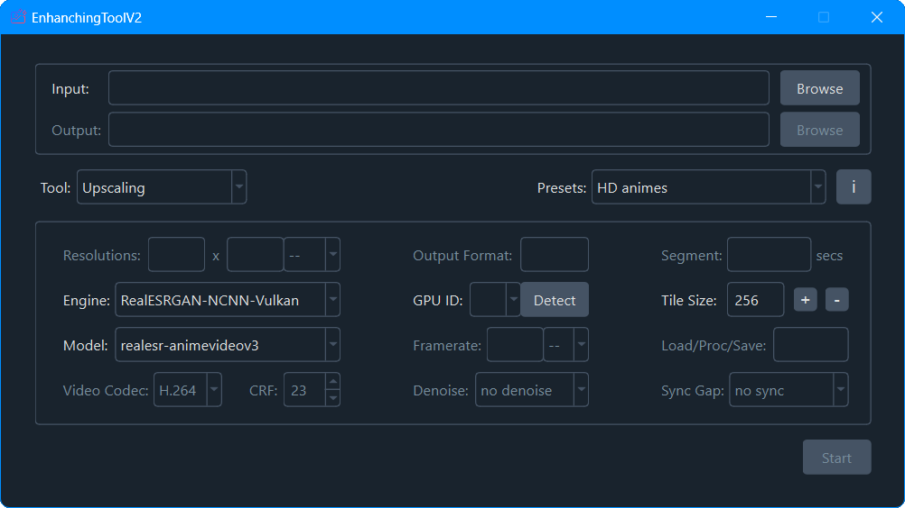
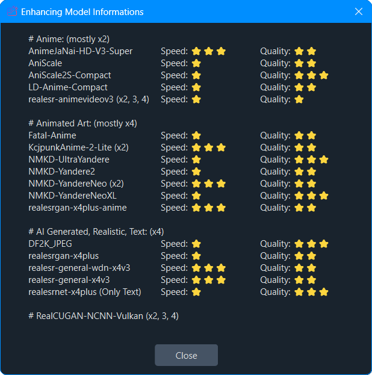

  
  <h2 align="center"> EnhancingToolV2: Video Frame Interpolation and Super Resolution </h2>
  </a>

# ℹ️ About EnhancingToolV2
EnhancingToolV2 is a state-of-the-art GUI application that utilizes advanced AI and NCNN inference by Tencent which is lightweight and runs on NVIDIA, AMD for video frame interpolation and image/video upscaling. It's designed with the Qt framework to provide a seamless user experience, offering intuitive controls for professional-quality enhancements.

## ✨ Key Features
- Full image style support (2D anime, or your daily photos & videos)
- Provides recommended presets for specific purposes
- Allows adjusting the tile size and the number of threads freely
- Adjusts the settings automatically to handle errors that occur during the upscaling or interpolating process
- Allows resizing to a specific resolution after upscaling
- Detects additional ESRGAN models automatically
- Easy-to-use graphical user interface
- Receives continual maintenance and updates

## 📦 Built-in Models

### Upscaling
>**realesr-animevideov3** - powered by [Xintao](https://github.com/xinntao)

>**realesrgan-x4plus** - powered by [Xintao](https://github.com/xinntao)

>**realesrgan-x4plus-anime** - powered by [Xintao](https://github.com/xinntao)

>**realesr-general-x4v3** - powered by [Xintao](https://github.com/xinntao)

>**realesr-general-wdn-x4v3** - powered by [Xintao](https://github.com/xinntao)

>**realesrnet-x4plus** - powered by [Xintao](https://github.com/xinntao)

>**AnimeJaNai-HD-V3-SuperUltraCompact** - powered by [the-database](https://github.com/the-database)

>**AniScale** - powered by [Sirosky](https://github.com/Sirosky)

>**AniScale2S-Compact** - powered by [Sirosky](https://github.com/Sirosky)

>**DF2K_JPEG** - powered by [jixiaozhong](https://openmodeldb.info/users/jixiaozhong)

>**Fatal-Anime** - powered by [Twittman](https://openmodeldb.info/users/twittman)

>**KcjpunkAnime-2-Lite** - powered by [KCJPUNK](https://openmodeldb.info/users/kcjpunk)

>**LD-Anime-Compact** - powered by [Skr](https://openmodeldb.info/users/skr) and [Zarxrax](https://openmodeldb.info/users/zarxrax)

>**NMKD-UltraYandere** - powered by [Nmkd](https://openmodeldb.info/users/nmkd)

>**NMKD-Yandere2** - powered by [Nmkd](https://openmodeldb.info/users/nmkd)

>**NMKD-YandereNeo** - powered by [Nmkd](https://openmodeldb.info/users/nmkd)

>**NMKD-YandereNeoXL** - powered by [Nmkd](https://openmodeldb.info/users/nmkd)

### Interpolation
>**RIFE-ncnn-Vulkan** - powered by [nihui](https://github.com/nihui)

>**IFRNet-ncnn-Vulkan** - powered by [nihui](https://github.com/nihui)

## 🆚 Upscaling Model Comparison

## ✅ Upscaling Samples
### AI Generated Image (1) upscaled by 4x-DF2K_JPEG
See [original](src/AI%20Generated%20Image%20(1)%20-%20Original.jpg) and [upscaled](src/AI%20Generated%20Image%20(1)%20-%204x-DF2K_JPEG.png) images

### AI Generated Image (2) upscaled by 4x-DF2K_JPEG
See [original](src/AI%20Generated%20Image%20(2)%20-%20Original.jpg) and [upscaled](src/AI%20Generated%20Image%20(2)%20-%204x-DF2K_JPEG.png) images

### Animated Art upscaled by 4x-NMKD-UltraYandere
See [original](src/Animated%20Art%20-%20Original.jpg) and [upscaled](src/Animated%20Art%20-%204x-NMKD-UltraYandere.png) images

### LR Animated Frame upscaled by 2x-AniScale2S-Compact
See [original](src/LR%20Animated%20Frame%20-%20Original.jpg) and [upscaled](src/LR%20Animated%20Frame%20-%202x-AniScale2S-Compact.png) images

### Noise Animated Frame upscaled by 2x-AniScale2S-Compact
See [original](src/Noise%20Animated%20Frame%20-%20Original.jpg) and [upscaled](src/Noise%20Animated%20Frame%20-%202x-AniScale2S-Compact.png) images

### Realistic Photo upscaled by 4x-DF2K_JPEG
See [original](src/Realistic%20Photo%20-%20Original.jpg) and [upscaled](src/Realistic%20Photo%20-%204x-DF2K_JPEG.png) images

## ✅ Interpolation Samples
**Model using: rife-v4.6**
## Sample 1
**Original**

https://github.com/leducthanhig/enhancing-tool-v2/assets/162028415/c55735a8-1325-4bae-bd64-e075c81de2e3

**Result**

https://github.com/leducthanhig/enhancing-tool-v2/assets/162028415/d6852c2b-65db-4017-b1fe-1f1cf8aa4fcd

## Sample 2
**Original**

https://github.com/leducthanhig/enhancing-tool-v2/assets/162028415/f443c52d-10ca-4bf8-b18d-a590ae426dd9

**Result**

https://github.com/leducthanhig/enhancing-tool-v2/assets/162028415/048d45a4-548d-41e2-bc74-05c7b5aa72f3

## Sample 3
**Original**

https://github.com/leducthanhig/enhancing-tool-v2/assets/162028415/8a982d04-49c3-4677-ae59-88de07d9ed26

**Result**

https://github.com/leducthanhig/enhancing-tool-v2/assets/162028415/e83b46cd-8f37-401f-99a7-324f0cbeef45

## Sample 4
**Original**

https://github.com/leducthanhig/enhancing-tool-v2/assets/162028415/191eb1d0-1ba8-4de6-a34d-258659a04fa0

**Result**

https://github.com/leducthanhig/enhancing-tool-v2/assets/162028415/f8c9fa43-ca63-41a4-ae66-3f43c3ec55d0

## Sample 5
**Original**

https://github.com/leducthanhig/enhancing-tool-v2/assets/162028415/04cfb897-3b16-47e4-9e2d-31e51b82f4c1

**Result**

https://github.com/leducthanhig/enhancing-tool-v2/assets/162028415/a541819a-8b67-4293-b070-4f6dd8fcaec1

## Sample 6
**Original**

https://github.com/leducthanhig/enhancing-tool-v2/assets/162028415/21408b9e-4903-4c88-9830-8ed32297d72d

**Result**

https://github.com/leducthanhig/enhancing-tool-v2/assets/162028415/0ae28071-94a6-4029-9a76-5f70681303e8

## Sample 7
**Original**

https://github.com/leducthanhig/enhancing-tool-v2/assets/162028415/94ea3647-578c-4e45-b44b-7a5c0bf6c0f9

**Result**

https://github.com/leducthanhig/enhancing-tool-v2/assets/162028415/eeb4521a-724e-4232-b07f-b5762c2c805e

## Sample 8
**Original**

https://github.com/leducthanhig/enhancing-tool-v2/assets/162028415/d558d3e5-3d0f-435a-a225-37ea0bd240c4

**Result**

https://github.com/leducthanhig/enhancing-tool-v2/assets/162028415/12c9ab4b-037e-443d-a531-0e87869a8a44

# ⬇️ Download Latest Release
Download the latest release for Windows x64 PCs with Intel/AMD/Nvidia GPUs with Vulkan support [here](https://github.com/leducthanhig/enhancing-tool-v2/releases/download/v2.5/EnhancingToolV2.Setup.msi)

📃 [See full change log](Change%20Log.txt)

# 💝 Credits
- [Qt](https://www.qt.io)
- [FFmpeg](https://ffmpeg.org)
- [Real-ESRGAN-ncnn-Vulkan](https://github.com/xinntao/Real-ESRGAN-ncnn-vulkan)
- [Real-CUGAN-ncnn-Vulkan](https://github.com/nihui/realcugan-ncnn-vulkan)
- [RIFE-ncnn-Vulkan](https://github.com/nihui/rife-ncnn-vulkan)
- [IFRNet-ncnn-Vulkan](https://github.com/nihui/ifrnet-ncnn-vulkan)
- [OpenModelDB](https://openmodeldb.info)
- [QDarkStyleSheet](https://github.com/ColinDuquesnoy/QDarkStyleSheet)
